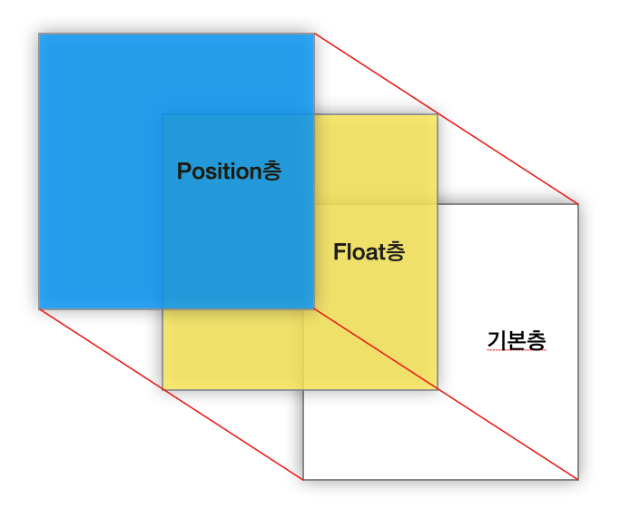

21년 0826의 TIL

## 오늘의 활동🤑

    1. Float 정복

오늘은 강의를 통해 **Float 속성**에 대해 배웠다.

Float은 다른 강의들에서 몇번 사용해본 적이 있었는데, 크게 다루지 않았던 것 같다. 초반 내용이라 그랬을 수도 있지만, 원리의 이해에 대한 내용들을 크게 없었다. "일단 clear을 줘서 여러 문제점을 해결해야 하고 그러면 짜잔! 이미지(혹은 원하는 박스를) 배치했습니다." 라는 설명을 한 뒤, "여러 문제들이 있기 때문에 보다 더욱 편리하고 최신의 기법인 Grid와 Flex를 사용합니다"라는 식으로 넘어가는 내용이 많았다.

Float은 구형의 기술이고, 앞으로는 사용하지 않을 거라는 이야기가 많았고 나도 그렇게 생각했다.
 
그래서 네이버의 PC버전 페이지가 FLOAT을 주로 사용했다고 했을 때 조금 놀랐었다.

너무 많은 페이지를 재개발 해야 하기 때문일까? 싶었지만 다양한 환경을 지원하고 안정적인 페이지 제공을 목표로 한다면 그게 맞겠구나 싶었다.

단순히 구식기능/신식기능으로 볼 것이 아니라 서비스를 제공하는 입장에서 사용자에게 많은 편의를 또는 알맞은 서비스를 제공하기 위해선 다양한 기술을 배워야 할 필요성을 새삼 깨달았다.

또 막상 배워보니 Float이 그렇게 복잡하지 않은 기술임을 알 수 있었다.

**Float 속성을 사용해 띄운 이미지는, 말 그대로 띄워져 다른 층으로 이동**하는 것이었다.

그렇기때문에 기본층에 남아있는 부모요소에서 포함되지 않게 되고, 형제요소들과의 포함관계도 이상해지는 것이었다.

또 흔히들 말하던 clear 속성을 줘야 고쳐진다는 이유도 알 수 있었다.

clear 속성을 주는건 float이 발생하는 오류를 없애기 때문이라는 설명을 줄곧 봐왔는데, 그게 아니였다. 딱히 문제라기 보다는 **위치 층이 달라지면서, 해당 요소를 감싸는 부모요소의 인식이 달라진 것**이다.

그래서 층이 달라지면서 보이지 않게 된 자식요소를 부모요소가 인식할 수 있도록, clear이라는 속성을 설정하는 것이었다. 이 작업은 **BFC**를 진행하는 속성을 부모코드에 부여하면서도 해결할 수 있다는 걸 알게 되었다.

(대표적인 예시: overflow: hidden)
 
원리를 정확히 이해하고나니 float은 정말 쉽게 느껴졌다.

또한 작업층에 대한 개념을 얻고 나서는 기존에 사용했던 position에 대해서도 더 명확한 이해를 갖출 수 있었다. 물론 실제로 코드를 짤 때는 사소한 문제들을 계속 마주했지만, 어떻게 float이란 속성을 사용하고, 어떤 방법으로 층의 인식을 진행시킬지에 대한 선택적인 진행이 가능해졌다.
 
CSS의 내용은 배울수록 새롭고 더욱 단단해지는 것 같아 뿌듯하고, 더 자세히 알고 싶은 욕심이 생긴다.
