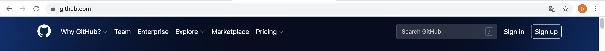
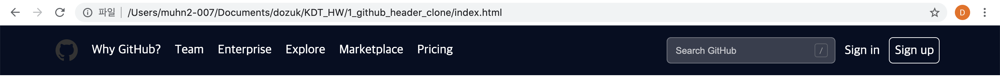

21년 0722의 TIL
## 오늘의 활동

        1. Github 페이지의 헤더를 따라 만들었다.

<p align="center">


<br>
<깃헙 헤더>
</p>

<br>

<p align="center">

<br>
<따라한 헤더>
</p>

HTML과 CSS을 사용하여 디자인과 구조적인 측면에서 최대한 따라 만드는 걸 목표로 했다.

헤더의 왼쪽 부분에 위치한 로고와 메뉴는 패캠 강의에서 예제를 통해 만들어 봤기 때문에 나름 쉽게 할 수 있었다.

문제는 좌우 정렬 방법과 오른쪽의 search bar 와 Sign in, Sing up 이었다.

- **좌우 정렬**

    ```css
    float: left;  //좌측정렬
    loat: right;  //우측정렬     /* float 사용 후에는 clearfix::after 처리가 필수 */
    ```

    왼쪽 메뉴 영역 제작할 때 사용했던 float: left; 값을 그대로 사용하니 요소들이 모두 왼쪽에 붙었다.

    그래서 우측 메뉴 영역 값을 float; right;로 변경했더니 지정된 범위 안에서 우측을 기준으로 정렬되는 것을 확인할 수 있었다. (**두 개의 다른 기준점 획득**)

    참고로 우측 영역의 메뉴 아이템들에 각각 float: right; 를 줬더니 단순하게 우측 정렬이 아니라

    먼저 작성한 메뉴 아아템 값 순서대로 오른쪽부터 작성되는 것을 알 수 있었다.

    ( [ Sign Up ] [ Sign in ] [ Search bar ] 순서대로 나열 )

    ```css
    /* CSS */

    .container-right{  /* 부모 클래스에 float를 주면 안의 메뉴 요소들이 우측 정렬된다*/
        **float: right;**
        width: 400px;
        height: 38px;
    }

    .search-bar{
        **float: left;** /* 메뉴 요소에 직접 float값을 right로 주면 요소 간의 정렬 순서가 변경 */
        margin-right: 5px;
        border: solid 1px rgba(255, 255, 255, 0.3);
    	border-radius: 6px;
        background: rgba(255, 255, 255, 0.2);
    }

    .sign-in{
        float: left;
        margin-right: 5px;
        padding: 8.5px;
    }

    }
    .sign-up{
        float: left;
        margin-right: 5px;
        padding: 7.5px;

        border: solid 1px white;
    	border-radius: 6px;

    .clearfix::after{
        content: "";
        display: block;
        clear: both;
    }

    /* html */
    <div class="container-right clearfix">

                        <div class="search-bar">
                            
                            <label>
                                <input type="text" placeholder="Search GitHub">
                                
                            </label>
                            
                        </div>
                        
                        <div class="sign-in">
                            <a href="">Sign in</a>
                        </div>
                        
                        <div class="sign-up">
                            <a href="">Sign up</a>
                        </div>
                        
                    </div>
                </div>
    ```

- **Search bar**
    1. Search Key img에 <label> 태그를 사용하여 클릭 시 Search bar로 연결되도록 설정
    2. Search bar의 의도한 검색창(=input type="text")의 크기를 설정할 때에는

        div가 아니라 **input을 직접 선택자로 지정**해야 하는 것을 알았다.

    3. 마찬가지로 <a> 태그 또한 직접 a를 선택해야 했다.

        ```css
        /* html */

        <div class="search-bar">                    
              <label> /* input과 img를 연결 */
                 <input type="text" placeholder="Search GitHub">
                 
              </label>                        
         </div>

        /* CSS */

        .search-bar{            /* 부모 태그는 레이어(도화지)와 같아서 내용물의 크기를 설정 X */
            float: left;        /* 내용물을 담는 레이어(도화지)의 크기, 위치 등을 담당*/
            margin-right: 5px;
        }

        .search-bar input{     /* 검색창인 input을 직접 선택하여 값을 변경 */
            width: 200px;
            height: 36px;
            padding: 0px;
            padding-left: 12px;
            border: 0;        /* 기본 border값을 삭제 */
            box-shadow: none; /* 배경 그림자를 삭제 */
            background-color: transparent; /* input의 배경색을 투명하게 설정 */
        }

        .search-bar input::placeholder{
            color: white      /* input 안의 placeholder의 값을 직접 선택하여 변경 */
        ```

    4. search key img가 input 검색창 안에 들어간 것 처럼 보이도록 설정

        ```css
        /* input의 적용된 기본 스타일을 삭제(투명하게 또는 none) */
        /* input과 img를 감싸는 부모태그(배경)에 border과 배경값을 설정하여 감쌈 */
        /* color: rgba (0, 0, 0, 투명도) 를 이용하여 배경색과 글자색 투명도를 조절 */

        /* CSS */

        .search-bar{
            float: left;
            margin-right: 5px;
            border: solid 1px rgba(255, 255, 255, 0.3); /* boder값과 투명도 조절 */
        	  border-radius: 6px; /* border 모서리 둥글게 설정 */
            background: rgba(255, 255, 255, 0.2) /* 배경색 투명도 설정 */
        }

        .search-bar input{
            width: 200px;
            height: 36px;
            padding: 0px;
            padding-left: 12px;
            border: 0;
            box-shadow: none;
            background-color: transparent;
        }

        .search-bar input::placeholder{
            color: rgba(255, 255, 255, 0.7); /* 글씨값 투명도 설정 */
        }

        .search-bar img{
            float: right;
            padding: 8px 0px;
            margin-right: 10px;
        }
        ```

- Sign in과 Sign up의 링크 밑줄 삭제 ( text-decoration: none; )
- Sign up에 border값과 border-radius 값 설정

<br>
<br>
         2. GIT 사용해서 파일관리 하는 방법 정리

사용 방법은 보통 따라서 하는 방법/절차를 찾기 위해 많이 검색하는 편이다. 때문에 부연 설명보다 지금 이 문제를 해결하기 위해 어떤 절차를 밟아야 하는지가 가장 잘 적혀있어야 한다고 생각한다.

그러나 많은 글들에는 부가 설명이 70%정도 차지하고 있었다.

그덕에 문제 해결을 위한 절차가 어떻게 연결되는지 파악하기 어려웠다.

왜 안되는가에 대한 설명은 알아둬야 할 것이지만, 이것에만 집중하다 보면 결국 문제 해결은 명확하지 못한 경우가 많았다.

초심자의 입장에서는 사용법을 익힐 때 알고리즘보다 어떻게 사용하는지를 먼저 아는 편이 더 좋다고도 생각한다.

손에 익숙해지고 작동 흐름을 파악한 다음이라면 기타 정보들에 대해서도 쉽게 이해할 수 있기 때문이다.

그래서 GIT의 주된 ADD/COMMIT/PUSH 사용법을 정리하였다.

정리를 하면서 그 흐름도 쉽게 파악할 수 있었고, 터미널 환경에도 익숙해질 수 있었다.